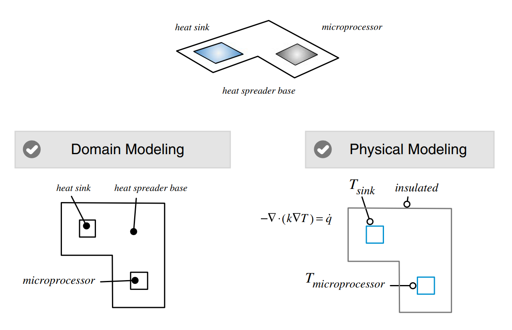
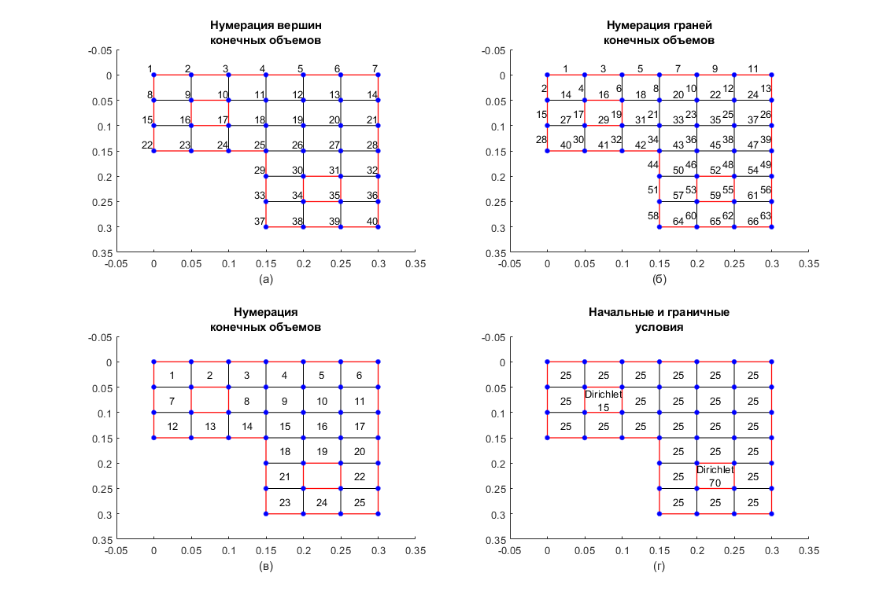

## Введение

Процесс математического моделирования некоторого физического процесса методом конечных объемов включает в себя несколько этапов:

* определение части пространства и интересующего нас физического процесса;
* дискретизация моделируемой геометрической области в сетку, которая формирует расчетную область (этот процесс (meshing или domain discretization) приводит к набору неперекрывающихся элементов, также называемых ячейками, которые покрывают расчетную область);
* дискретизация уравнений, которая преобразует набор дифференциальных уравнений в частных производных с начальными и граничными условиями, в эквивалентную систему алгебраических уравнений, определенную для каждого из элементов расчетной области;
* решение полученной системы уравнений для получения поля промежуточного или окончательного решения.

## Построение математической модели



**Рисунок 1.** Процесс построения математической модели


В данной работе будет рассмотрена следующая физическая модель. На рисунке 1 изображен микропроцессор, подключенный к радиатору с медным основанием, который действует как рассеиватель тепла. Построим упрощенную математическую модель. Радиатор и процессор заменяются граничными условиями, которые определяют расчетную температуру радиатора и ожидаемую рабочую температуру процессора соответственно. Физическая область моделируется как двумерная расчетная сетка, поскольку изменение температуры по толщине радиатора будет минимальным. Для стационарного решения теплового потока и распределения температуры в медном основании учитывается только теплопроводность. Результатом процесса моделирования является линейное (или нелинейное, если $ k $ зависит от $T$) дифференциальное уравнение в частных производных, которое в данном случае включает в себя упрощенную форму уравнения теплопроводности, задаваемого формулой:
$$
\begin{equation}
\frac{dT}{dt} - \nabla \cdot (k \nabla T) = 0
\end{equation}
$$

где $k$ - теплопроводность основания теплораспределителя.

Значение параметра теплопроводности выберем постоянным и равным:

```matlab
conduct = 0.00125;
```

## Дискретизация расчетной области


**Рисунок 2.** Обозначения для конечного объема


Геометрическая дискретизация физической области приводит к сетке, на которой в конечном итоге решаются уравнения сохранения. Данный процесс требует разделения области на дискретные неперекрывающиеся ячейки или элементы, которые полностью заполняют вычислительную область. Существует множество различных методов построения расчетной сетки, что приводит широкому спектру типов сеток, которые классифицируются по нескольким характеристикам: структура, ортогональность, блоки, форма ячеек и т.д. Во всех случаях сетка состоит из дискретных элементов, определяемых набором вершин и ограниченных гранями. Чтобы сетка была удобной для дискретизации уравнений, необходима информация, связанная с топологией элементов сетки, в дополнение к некоторой произвольной геометрической информации. К этой информации относится принадлежность граней к элементам, принадлежность вершин к граням, соседство элементов, центр тяжести и объем элемента, центр тяжести грани, площадь грани, направление нормали и т.д. Эта информация обычно выводится из базовых данных сетки. Для некоторой топологии сетки подробности о сетке могут быть легко выведены из индексов элементов, как в структурированных сетках, в то время как для других она должна быть построена и сохранена в списках для последующего поиска, как в случае с неструктурированными сетками.

Как изображено на рисунке 2, определимся с размерами конечного объема и расстоянием между центрами элементов. Так как сетка будет равномерной, расстояние между центрами ячеек будет совпадать с размерами ячеек и равно:

```matlab
Dx = 0.05;
Dy = 0.05;
dx = Dx;
dy = Dy;
```

Расчетная сетка будет разбита на 25 элементов. Каждый элемент определяется координатой левой верхней и правой нижней вершины. Всего для 25 элементов понадобится 40 вершин, определим их:

```matlab
vertices = zeros(40,2);
k = 0;
for i=1:40
    if i<=28
        if mod(i-1,7) == 0
            k = k + 1;
        end 
        vertices(i,:) = [Dx*mod(i-1,7), Dy*(k-1)];
    else
        if mod(i-1,4) == 0
            k = k + 1;
        end 
        vertices(i,:) = [Dx*3+Dx*mod(i-1,4), Dy*(k-1)];
    end     
end
```

Далее необходимо определить координаты граней, которые будут определять составленные вершины. 40 вершин определяют 66 граней:

```matlab
faces = zeros(66,2);
maxX = max(vertices(:,1));
maxY = max(vertices(:,2));
count = 0;
k = 0; 
for i=1:40
    if i<=21
        if mod(i-1,7) == 0
            k = k + 1;
        end 
        if vertices(i,1) < maxX
            count = count + 1;
            faces(count,:) = [i, i+1];
        end
        if vertices(i,2) < maxY
            count = count + 1;
            faces(count,:) = [i, i+7];
        end
    else
        if i<25
            count = count + 1;
            faces(count,:) = [i, i+1];
        else
            if vertices(i,1) < maxX
                count = count + 1;
                faces(count,:) = [i, i+1];
            end
            if vertices(i,2) < maxY
                count = count + 1;
                faces(count,:) = [i, i+4];
            end
        end
    end 
end
```

Определим координаты центров вершин:

```matlab
cellCenters = zeros(25, 2);
k = 0;
count = 0;
for i=1:27
    if i<=18
        if mod(i-1,6) == 0
            k = k + 1;
        end
        x = dx/2 + dx*mod(i-1,6);
        y = dy/2 + (k-1)*dy;
        if (round(x,3) ~= round(3*dx/2,3)) || (round(y,3) ~= round(3*dy/2,3))
            count = count + 1;
            cellCenters(count,:) = [x,y];
        end
    else
        if mod(i-1,3) == 0
            k = k + 1;
        end
        x = 7*dx/2 + dx*mod(i-1,3);
        y = dy/2 + (k-1)*dy;
        if (round(x,3) ~= round(9*dx/2,3)) || (round(y,3) ~= round(9*dy/2,3))
            count = count + 1;
            cellCenters(count,:) = [x,y];
        end
    end
end
```

Выпишем грани, соответствующие определенным элементам:

```matlab
cellFaces = zeros(25,4);
cellFaces(1,:) = [1, 2, 4, 14];
for i=2:5
    cellFaces(i,:) = cellFaces(i-1,:) + 2;
end
cellFaces(6,:) = cellFaces(5,:) + [2, 2, 1, 2];
cellFaces(7,:) = cellFaces(6,:) + [3, 3, 4, 3];
cellFaces(8,:) = cellFaces(7,:) + [4, 4, 4, 4];
cellFaces(9,:) = cellFaces(8,:) + [2, 2, 2, 2];
cellFaces(10,:) = cellFaces(9,:) + [2, 2, 2, 2];
cellFaces(11,:) = cellFaces(10,:) + [2, 2, 1, 2];
cellFaces(12,:) = cellFaces(11,:) + [3, 3, 4, 3];
cellFaces(13,:) = cellFaces(12,:) + [2, 2, 2, 1];
cellFaces(14,:) = cellFaces(13,:) + [2, 2, 2, 1];
cellFaces(15,:) = cellFaces(14,:) + [2, 2, 2, 1];
cellFaces(16,:) = cellFaces(15,:) + [2, 2, 2, 2];
cellFaces(17,:) = cellFaces(16,:) + [2, 2, 1, 2];
cellFaces(18,:) = cellFaces(17,:) + [6, 6, 7, 3];
cellFaces(19,:) = cellFaces(18,:) + [2, 2, 2, 2];
cellFaces(20,:) = cellFaces(19,:) + [2, 2, 1, 2];
cellFaces(21,:) = cellFaces(20,:) + [3, 3, 4, 3];
cellFaces(22,:) = cellFaces(21,:) + [4, 4, 3, 4];
cellFaces(23,:) = cellFaces(22,:) + [3, 3, 4, 3];
cellFaces(24,:) = cellFaces(23,:) + [2, 2, 2, 1];
cellFaces(25,:) = cellFaces(24,:) + [2, 2, 1, 1];
```

Также выпишем соседствующие между собой элементы:

```matlab
cellNeighbors = zeros(25, 4);
cellNeighbors(1,:) = [0,0,2,7];
cellNeighbors(2,:) = [0,1,3,0];
cellNeighbors(3,:) = [0,2,4,8];
cellNeighbors(4,:) = [0,3,5,9];
cellNeighbors(5,:) = [0,4,6,10];
cellNeighbors(6,:) = [0,5,0,11];
cellNeighbors(7,:) = [1,0,0,12];
cellNeighbors(8,:) = [3,0,9,14];
cellNeighbors(9,:) = [4,8,10,15];
cellNeighbors(10,:) = [5,9,11,16];
cellNeighbors(11,:) = [6,10,0,17];
cellNeighbors(12,:) = [7,0,13,0];
cellNeighbors(13,:) = [0,12,14,0];
cellNeighbors(14,:) = [8,13,15,0];
cellNeighbors(15,:) = [9,14,16,18];
cellNeighbors(16,:) = [10,15,17,19];
cellNeighbors(17,:) = [11,16,0,20];
cellNeighbors(18,:) = [15,0,19,21];
cellNeighbors(19,:) = [16,18,20,0];
cellNeighbors(20,:) = [17,19,0,22];
cellNeighbors(21,:) = [18,0,0,23];
cellNeighbors(22,:) = [20,0,0,25];
cellNeighbors(23,:) = [21,0,24,0];
cellNeighbors(24,:) = [0,23,25,0];
cellNeighbors(25,:) = [22,24,0,0];
```




**Рисунок 3.** Визуализация данных расчетной сетки

Как видно из рисунка 1, должны быть заданы 3 граничных условия: условия на микропроцессоре, на радиаторе, а также на базе радиатора. По рисунку 3 (б) определим соответствующие грани, выпишем их в отдельные массивы:

```matlab
patch1 = [1, 3, 5, 7, 9, 11, 13, 26, 39, 49, 56, 63, 66, 65, 64, 58, 51, 44, 42, 41, 40, 28, 15, 2];
patch2 = [16, 17, 19, 29];
patch3 = [52, 53, 55, 59];
```

Определим значения температуры на границах, начальные значения в каждой ячейке, а также тип граничных условий для базы радиатора и визуализируем построенную сетку:

```matlab
type = 1;
T1 = 25;
T2 = 15;
T3 = 70;

T = 25 * ones(25,1);

plots(vertices, faces, cellCenters, patch1, patch2, patch3, Dx, Dy, dx, dy, T, T2, T3)
```


## Дискретизация уравнения

### Дискретизация по времени

Для производной по времени используем стандартный метод Эйлера. Схема будет неявной, первое слагаемое уравнения (1)  аппроксимируется следующим образом:
$$
\frac{dT}{dt} = \frac{T_C^{new} - T_C}{\Delta t}
$$
где

$\Delta t$ - шаг по времени

$T_C$ - значение $T$ в ячейке $C$ на текущий момент времени

$T_C^{new}$ - значение $T$ в ячейке $C$ на новый момент времени

### Пространственная дискретизация

Процесс дискретизации второго слагаемого начинается с интегрирования его по контрольному элементу $ C $, что позволяет записать уравнение в интегральном виде:
$$
\begin{equation}
-\iint_{V_c} \nabla \cdot (k \nabla T) dV = 0 
\end{equation}
$$
По теореме Гаусса интеграл по объему преобразуется в интеграл по поверхности:
$$
\begin{equation}
-\int_{S_c} (k \nabla T) \cdot d \boldsymbol{S} = 0 
\end{equation}
$$
Полученное уравнение по-сути является уравнением теплового баланса элемента $C$. Заменяя интеграл по поверхности суммированием по граням контрольного объема, уравнение (4) примет вид:
$$
\begin{equation}
-\sum_{f \sim nb(C)} (k \nabla T)_f \cdot \boldsymbol{S}_f = 0 
\end{equation}
$$
где $f$ представляет собой значение в центре масс ограничивающей грани. Полученное уравнение является первым приближением уравнения. Интеграл в уравнении (4) численно аппроксимируется потоками через центры масс граней. 

Раскроем сумму в уравнении (5):
$$
-(k \nabla T)_{f_1} \cdot \boldsymbol{S}_{f_1}
-(k \nabla T)_{f_2} \cdot \boldsymbol{S}_{f_2}
-(k \nabla T)_{f_3} \cdot \boldsymbol{S}_{f_3}
-(k \nabla T)_{f_4} \cdot \boldsymbol{S}_{f_4}
=
0
$$
Распишем выражение для грани $f_1$ согласно рисунку 2:
$$
\begin{equation}
\begin{matrix}
\boldsymbol{S}_{f_1} = \Delta y_{f_1} \boldsymbol{i} \\
\delta x_{f_1} =x_{F_1} - x_{C} \\
\nabla T_{f_1} = (\frac{\partial T}{\partial x})_{f_1} \boldsymbol{i} +
(\frac{\partial T}{\partial y})_{f_1} \boldsymbol{j}
\end{matrix}
\end{equation}
$$
где:

$x_C$ - координата $x$ центра масс элемента $C$;

$x_{F_1}$ - координата $x$ центра масс элемента $F_1$;

$\Delta y_{f_1}$ - площадь грани $f_1$;

$\boldsymbol{S}_{f_1}$ - площадь грани $f_1$, умноженная на нормаль, направленную из $C$;

$\nabla T_{f_1}$ - градиент $T$ в центре грани $f_1$.

Первое слагаемое в уравнении (5) можно переписать как:
$$
\nabla T_{f_1} \cdot \boldsymbol{S}_{f_1} = (\frac{\partial T}{\partial x} \boldsymbol{i} +
\frac{\partial T}{\partial y} \boldsymbol{j})_{f_1} \cdot \Delta y_{f_1} \boldsymbol{i} =
(\frac{\partial T}{\partial x})_{f_1} \Delta y_{f_1}
$$
Предполагая линейное изменение $T$, компонента $x$ градиента на грани $f_1$ может быть записана как:
$$
(\frac{\partial T}{\partial x})_{f_1} = \frac{T_{F_1} - T_C}{\delta x_{f_1}}
$$
Таким образом, уравнение (8) аппроксимируется как:
$$
\nabla T_{f_1} \cdot \boldsymbol{S}_{f_1} = 
\frac{T_{f_1} - T_C}{\delta x_{f_1}} \Delta y_{f_1}
$$
или в более общем виде:
$$
-(k \nabla T)_{f_1} \cdot \boldsymbol{S}_{f_1} = a_{F_1} (T_{F_1} - T_C)
$$
где
$$
a_{F_1} = -k \frac{\Delta y_{f_1}}{\delta x_{f_1}}
$$
Повторяя данные операции для всех граней, получим следующие коэффициенты:
$$
\begin{matrix}
a_{F_2} = -k \frac{\Delta x_{f_2}}{\delta y_{f_2}} \\
a_{F_3} = -k \frac{\Delta y_{f_3}}{\delta x_{f_3}} \\
a_{F_4} = -k \frac{\Delta x_{f_4}}{\delta y_{f_4}}
\end{matrix}
$$
Таким образом, выражение (6) запишется как:
$$
\begin{matrix}
- \sum_{f \sim nb(C)} (k \nabla T)_f \cdot \boldsymbol{S}_f = \sum_{F \sim NB(C)} a_F (T_F - T_C) = \\
= -(a_{F_1} + a_{F_2} + a_{F_3} + a_{F_4})T_C + a _{F_1}T_{F_1} + a _{F_2}T_{F_2} + a _{F_3}T_{F_3} + a _{F_4}T_{F_4}
\end{matrix}
$$

### Дискретизация исходного уравнения

В результате дискретизации уравнение (1) запишется следующим образом:
$$
\frac{T_C^{new} - T_C}{\Delta t} - (a_{F_1} + a_{F_2} + a_{F_3} + a_{F_4})T_C^{new} + a _{F_1}T_{F_1}^{new} + a _{F_2}T_{F_2}^{new} + a _{F_3}T_{F_3}^{new} + a _{F_4}T_{F_4}^{new} = 0
$$
Или в более коротком виде:
$$
a_c T_c^{new} + \sum_{F \sim NB(C)} a_{f}T_{f} = b_c
$$
где
$$
\begin{matrix}
a_C = -(a_{F_1} + a_{F_2} + a_{F_3} + a_{F_4} + \frac{1}{\Delta t}) \\
b_C = \frac{T_C}{\Delta t}
\end{matrix}
$$

### Граничные и начальные условия

Рассмотрим два вида граничных условий:

* Задано значение температуры $T_B$ на границе
* Задан поток $ a_B $ на границе (рассмотрим только случай $a_B=0$, то есть грань будет теплоизолирована)

Второй случай самый простой, так как данная грань не будет участвовать в дискретизации, все коэффициенты для нее будут равны нулю. Первый случай аналогичен случаю, когда рассматриваются два соседних блока, только будет считаться равным $\frac{\delta x}{2}$ или $ \frac{\delta y}{2}$, а также температура на границе будет считаться известной, поэтому $a_B T_B$ будет относится к правой части.


## Решение системы

Определим шаг по времени, начальный и конечный момент времени и решим полученную систему уравнений для каждого момента времени:

```matlab
deltat = 100;
time = 0; 

g = figure;
set(g, 'Name', 'Расчет модели');
hold on;
for i=1:66
    plot([vertices(faces(i,1),1),vertices(faces(i,2),1)], [vertices(faces(i,1),2),vertices(faces(i,2),2)], 'k-');   
end
for i=1:length(patch1)
    face = patch1(i);
    plot([vertices(faces(face,1),1),vertices(faces(face,2),1)], [vertices(faces(face,1),2),vertices(faces(face,2),2)], 'r-', 'LineWidth', 1);
end
for i=1:length(patch2)
    face = patch2(i);
    plot([vertices(faces(face,1),1),vertices(faces(face,2),1)], [vertices(faces(face,1),2),vertices(faces(face,2),2)], 'r-', 'LineWidth', 1);
end
for i=1:length(patch3)
    face = patch3(i);
    plot([vertices(faces(face,1),1),vertices(faces(face,2),1)], [vertices(faces(face,1),2),vertices(faces(face,2),2)], 'r-', 'LineWidth', 1);
end
pointsize = 500;
scatter(cellCenters(:,1),cellCenters(:,2), pointsize, T, 'filled', 'Marker', 'o');
colormap('jet')
colorbar;
set(gca, 'YDir','reverse');
xlim([min(vertices(:,1))-Dx, max(vertices(:,1))+Dx]);
ylim([min(vertices(:,2))-Dy, max(vertices(:,2))+Dy]);

title({time, " секунд"});
pause(2);

while time <= 10000
    A = zeros(25, 25);
    b = zeros(25, 1); 
    for i=1:25
        for j=1:length(cellFaces(i,:))
            if (j == 2) || (j == 3)
                D = Dy;
                d = dx;
            else
                D = Dx;
                d = dy;
            end
            if any(patch1 == cellFaces(i,j))
                if(type == 1)
                    flux = (-conduct * D)/ (d/2);
                else
                    flux = 0;
                end
                b(i) = b(i) - flux*T1;
                A(i,i) = A(i,i) - flux;
            elseif any(patch2 == cellFaces(i,j))
                flux = (-conduct * D)/ (d/2);
                b(i) = b(i) - flux*T2;
                A(i,i) = A(i,i) - flux;
            elseif any(patch3 == cellFaces(i,j))
                flux = (-conduct * D)/ (d/2);
                b(i) = b(i) - flux*T3;
                A(i,i) = A(i,i) - flux;
            else
                flux = (-conduct * D)/d;
                A(i, cellNeighbors(i,j)) = flux;
                A(i,i) = A(i,i) - flux;
            end
        end 
        b(i) = b(i) + T(i)/deltat;
        A(i,i) = A(i,i) + 1/deltat;
    end 
    T = A\b;
    scatter(cellCenters(:,1),cellCenters(:,2), pointsize, T, 'filled', 'Marker', 'o');
    colormap('jet')
    colorbar;
    title({time, " секунд"});
    pause(0.1);
    time = time + deltat;
end 
hold off;

```

Как видно из полученной анимации, температура поднимается только в районе непосредственно микропроцессора, не поднимаясь дальше возле радиатора. Это связано с тем, что на границе базы радиатора задано условие первого рода, что не совсем соответствует физической задаче. Необходимо задать условие второго рода с нулевым значением, тогда база радиатора станет "проводником" тепла от микропроцессора к радиатору без потерь, что более соответствует реальной задаче. Таким образом, на рисунке 4 можно сравнить результаты для граничных условий первого и второго рода.


**Рисунок 4** Результаты численного моделирования с граничными условиями первого (а) и второго (б) рода.


## Выводы

Использование метода конечных объемов для моделирования различных физических задач, с одной стороны, вызывают определенную сложность при построении сетки, вычислении потоков через границы, решения системы и прочих трудностей. Но, с другой стороны, возможность использования различных сеток предоставляет большую гибкость при составлении модели, по сравнению с тем же методом конечных разностей, а величины потоков позволяют легко задавать граничные условия. Сложность построения сетки также можно нивелировать путем использования готовых открытых библиотек численного моделирования методом конечных объемов, таких, как OpenFOAM&reg;.
